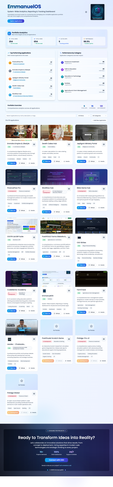

# EmmanuelOS - Application Portfolio Dashboard

EmmanuelOS is a web application that serves as a centralized dashboard for managing and displaying a portfolio of applications across multiple business domains.

## Overview

This dashboard provides tools for organizing, monitoring, and presenting applications built across different sectors including e-commerce, finance, agriculture, education, and professional services. The system uses modern web technologies to deliver a responsive interface with real-time analytics capabilities.

## Technical Architecture

### Frontend Technologies
- **Next.js 15.0.1** - React framework using the App Router for optimal performance and SEO
- **React 19.1.0** - Component-based UI with concurrent rendering features
- **TypeScript 5.3.3** - Static type checking for development reliability
- **Tailwind CSS 3.4.1** - Utility-first styling with custom design system
- **Framer Motion 11.0** - Animation library for smooth user interactions

### Backend and Data Management
- **Supabase 2.39.3** - PostgreSQL database with real-time subscription capabilities
- **Prisma 6.16.2** - Type-safe database ORM for data operations
- **Umami Analytics** - Privacy-focused analytics for user behavior tracking

### Development and Quality Tools
- **ESLint 8.57.0** - Code linting and style enforcement
- **TypeScript Compiler** - Type checking and IntelliSense support
- **Vercel** - Deployment platform with global CDN and edge computing

## Application Portfolio

The dashboard organizes applications by business domain:

### E-commerce and Business Applications
- **Emmdra Empire** - Lifestyle and commerce platform for the Nigerian market
- **Zereth Cakes Hub** - Cake ordering and bakery management system
- **CEOTR Ltd ERP** - Enterprise resource planning for business operations
- **PoshPOULE Farms** - Agricultural marketplace platform

### Financial Technology Applications
- **FinanceFlow Pro** - Personal financial planning and budgeting tool
- **FinEdge-Pro** - Cryptocurrency trading simulation platform
- **FinEdge Global** - Open-source fintech infrastructure

### Agriculture and Food Technology
- **FarmTrack** - Farm management and monitoring system
- **PoshPOULE Farms** - Agricultural supply chain platform

### Education and Learning Platforms
- **CodeMentor Academy** - AI-assisted coding education platform
- **Bible Game Hub** - Interactive faith-based educational games

### Professional Services
- **ceodev Portfolio** - Professional services showcase and client portal
- **Workflow Hub** - Directory of AI tools and productivity applications

### Content and Community Platforms
- **CEO Writes** - Personal blog and content management system
- **Jepligom Ministry** - Community portal for religious organization

## System Features

### Dashboard Analytics
The main dashboard provides real-time insights into application performance and user engagement. Key metrics include:
- Application usage statistics and trends
- User behavior patterns and preferences
- Performance monitoring across the portfolio
- Search analytics and discovery metrics

### Application Management
- Centralized view of all applications and their current status
- Filtering and search capabilities across the portfolio
- Status tracking for development and deployment stages
- Integration with external services and platforms

### Administrative Controls
- User role management and permissions
- Analytics configuration and privacy settings
- Database management and content seeding
- Performance monitoring and optimization tools

## Installation and Setup

### Requirements
- Node.js version 18 or higher
- npm, yarn, or pnpm package manager
- Git for version control

### Getting Started
1. Clone the repository:
```bash
git clone https://github.com/e-ogugua/emmanuelos.git
cd emmanuelos
```

2. Install dependencies:
```bash
npm install
```

3. Set up environment variables by copying the example file:
```bash
cp .env.example .env.local
```

4. Configure the required environment variables:
```bash
NEXT_PUBLIC_SUPABASE_URL=your_supabase_project_url
NEXT_PUBLIC_SUPABASE_ANON_KEY=your_supabase_anon_key
NEXT_PUBLIC_UMAMI_WEBSITE_ID=your_umami_website_id
```

5. Start the development server:
```bash
npm run dev
```

The application will be available at `http://localhost:3000`.

### Production Deployment
```bash
# Build the application
npm run build

# Deploy to production
npm run start
```

For deployment to platforms like Vercel:
```bash
# Install Vercel CLI and deploy
npm i -g vercel
vercel --prod
```

## Design and User Experience

### Visual Design System
The interface uses a glassmorphism design approach with translucent elements and backdrop blur effects. The color scheme emphasizes blue tones for primary actions with supporting colors for different application categories.

### Responsive Design
The dashboard adapts to different screen sizes with responsive grid layouts and mobile-optimized interactions. All components maintain consistent behavior across desktop, tablet, and mobile devices.

### Performance Considerations
- Components use React.memo for optimization
- Dynamic imports reduce initial bundle size
- Skeleton loading states provide smooth transitions
- Images are optimized with Next.js Image component
- Analytics loading is deferred until after user interaction

## Development Practices

### Code Quality
- TypeScript strict mode for type safety
- ESLint configuration for code consistency
- Prettier for code formatting
- Meaningful commit messages following conventional commits

### Testing Strategy
- Unit tests with Jest and React Testing Library
- End-to-end testing with Playwright
- Lighthouse performance monitoring
- Accessibility testing with axe-core

### Project Structure
```
src/
├── app/           # Next.js App Router pages and API routes
├── components/    # Reusable React components
├── contexts/      # React Context providers for state management
├── hooks/         # Custom React hooks
├── lib/           # Utility functions and business logic
└── data/          # Static data and configuration
```

## Contributing

Contributions follow standard open source practices with focus on code quality and documentation. See CONTRIBUTING.md for detailed guidelines.

## License

This project is private and intended for personal portfolio use. All rights reserved.

## Author

Developed by CEO – Chukwuka Emmanuel Ogugua.

## Screenshots

Add a hero screenshot here for quick visual context.



## Roadmap

Track progress and upcoming work in the Roadmap:
https://github.com/e-ogugua/emmanuelos/issues?q=is%3Aissue+Roadmap

## Ecosystem Links
- Portfolio Hub: https://ceodev.vercel.app/
- EmmanuelOS Repo: https://github.com/e-ogugua/emmanuelos
- Workflow Hub: https://github.com/e-ogugua/workflow-hub
- FinanceFlow Pro: https://github.com/e-ogugua/financeflow-pro
- PoshPOULE ERP: https://github.com/e-ogugua/PoshPOULE-Farms-suite

## Links
- Releases: https://github.com/e-ogugua/emmanuelos/releases
- Security Policy: ./SECURITY.md
